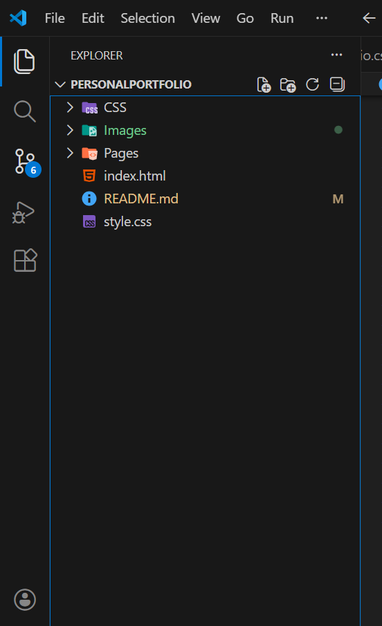
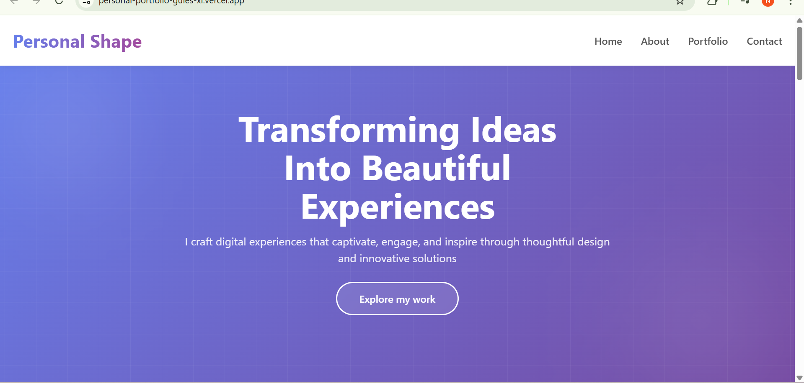
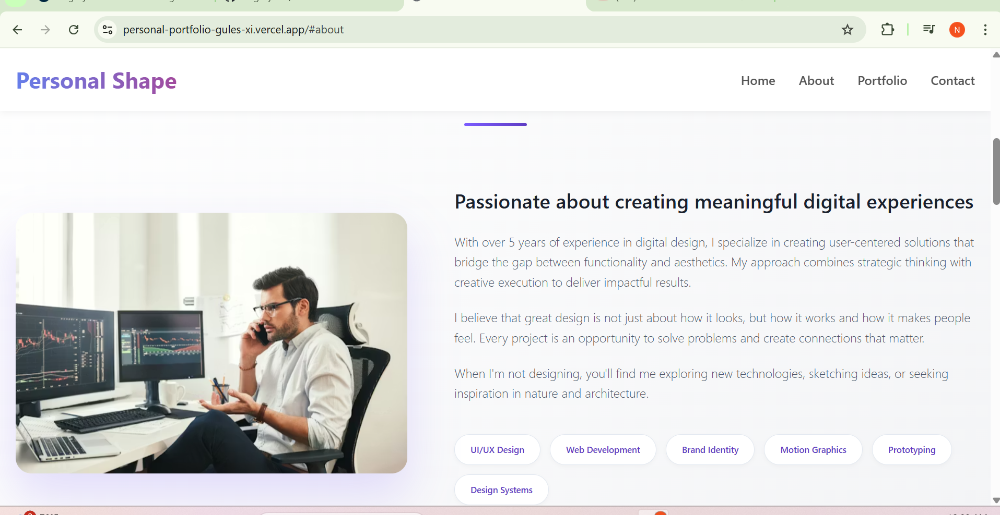
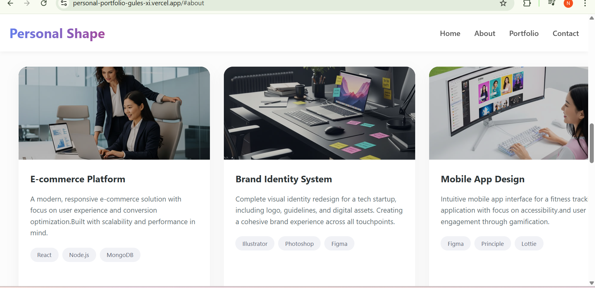
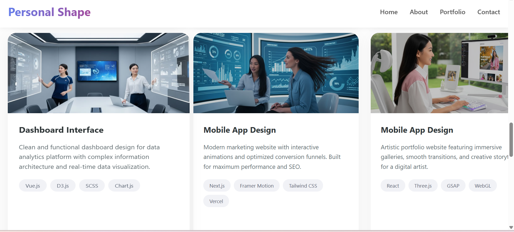

## Overview of the Project

This portfolio website presents a clean and modern online presence, showcasing personal information, skills, and projects. The design prioritizes simplicity, responsiveness, and performance across all devices.

---

## Project Collaboration

This project was developed collaboratively by two developers using GitHub, including:

- Git-based version control  
- Shared development workflow  
- Collaborative design and implementation  
- Real-world teamwork experience  

---

## Project Structure



---

## Key Features

- Modern and professional UI design  
- Fully responsive layout (desktop, tablet, mobile)  
- Clear section-based navigation  
- Portfolio cards with visual previews  
- Functional contact form layout  
- Smooth and consistent styling  

---

## Technologies Used

- **HTML5** – semantic structure  
- **CSS3** – styling, gradients, and responsive layout  
- **JavaScript** – interactivity  
- **Git & GitHub** – collaboration and version control  
- **Vercel** – deployment and hosting  

---

## Local Setup (GitHub Clone)

Open your terminal and run:

```bash
git clone https://github.com/your-username/personal-portfolio.git
cd personal-portfolio
code .

```

## Key Features

 Modern and professional UI design

 Fully responsive layout (desktop, tablet, mobile)

 Clear section-based navigation

 Portfolio cards with visual previews

 Functional contact form layout

 Smooth and consistent styling


## Technologies We Used

 HTML5 –  semantic Structure

 CSS3 – styling, gradients and responsive layout

 JavaScript – interactivity 

 Git & GitHub – collaboration and version control

 Vercel – deployment and hosting


## Local Setup Github Clone

 Open terminal then write 
  git clone https://github.com/your-username/personal-portfolio.git cd personal-portfolio
 code . for the terminal.


## Website Sections

### Homepage (Hero Section)




The homepage introduces the brand Personal Shape with a bold headline: “Transforming Ideas Into Beautiful Experiences”, accompanied by a short description and a clear call-to-action button.


## About Section

### About



The about section highlights passion for creating meaningful digital experiences, professional background, and areas of expertise such as UI/UX Design, Web Development, Brand Identity, Motion Graphics, Prototyping, and Design Systems.


## Portfolio Section

### Portfolio




 The portfolio section showcases multiple projects with images, titles, descriptions, and related technologies, including:

 E-commerce Platform

 Brand Identity System

 Mobile App Design

 Dashboard Interface

 Marketing Website

 Creative Portfolio Website


## Contact Section

### Contact


 The contact section includes a professional message invitation and a form with the following fields:

 Name

 Email

 Subject

 Message


## Purpose

 This project was created to:

 Create a professional online portfolio

 Showcase creative and design-focused projects

 Demonstrate frontend development skills

 Practice real-world GitHub collaboration

 Support academic and professional presentation


## Contributors  (GitHub collaboration project)

 Abdi kani Mohamed  – J.Developer

 Eng Ahmed Omar  – J.Developer


## License

 This project is intended for personal and educational use.

